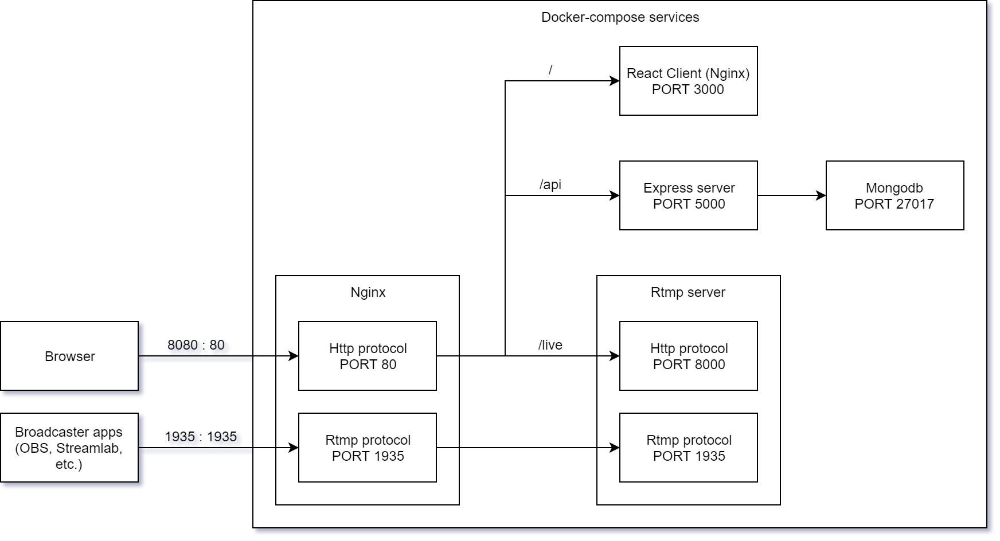

# Streamiz (Version without Docker)

https://github.com/KENJIFAM/streams/tree/original

# Streamiz (Version with Docker)

This is an app that allows users to create a live stream video based on a rtmp server and flv player.

Tech stacks: TypeScript, React, Redux, Semantic UI, Webpack, Node.js, Express, MongoDB, Google OAuth 2, Docker, Google Compute Engine (Linux VPS)

## Demo

Feel free to try and share: https://streamiz.kenjifam.fi

## App architecture

## How to use

Login with Google account, create a new stream.

Copy the <b>Live stream link</b> `rtmp://live.kenjifam.fi/live/<STREAM_KEY>` to a broadcaster application and all done.

Free broadcaster applications: 
- [Open Broadcaster Software](https://obsproject.com/download) (Windows, macOS, Linux)
- [Streamlabs](https://play.google.com/store/apps/details?id=com.streamlabs) (Android)
- [Streamlabs: Stream Live](https://itunes.apple.com/us/app/streamlabs-stream-live/id1294578643) (iOS)

